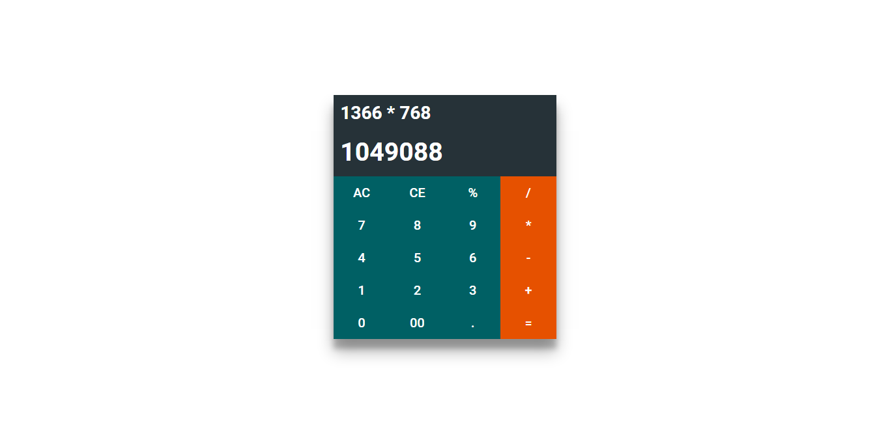

# Twitch API - Streamers 

A calculator app with Material Design and Angular.

### Live app
URL: https://github.com/Purush0th/angular-calc


### Screen shot
<br/>

<br/>

### Running the App

You can install http-server globally:

```
npm install -g serve
```

Then you can start your own development web server to serve static files from a folder by running:

>Move to the `src` folder.</br>
>Run `serve` in a Terminal window</br>
>Open browser to url `http://localhost:3000`

### Resources
* Material design specification - https://www.google.com/design/spec/material-design/introduction.html
* Angular JS - https://angularjs.org/
* Angular Material - https://material.angularjs.org/latest/
